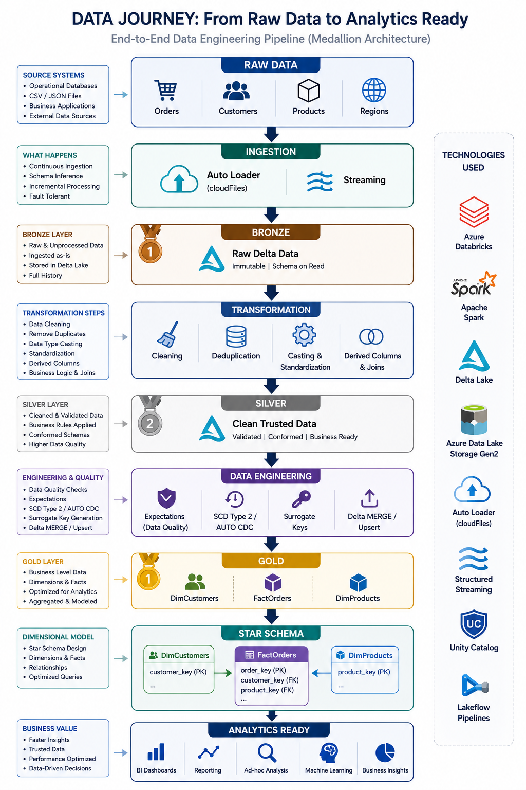
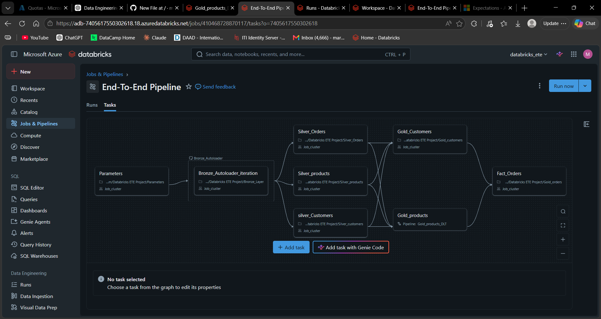
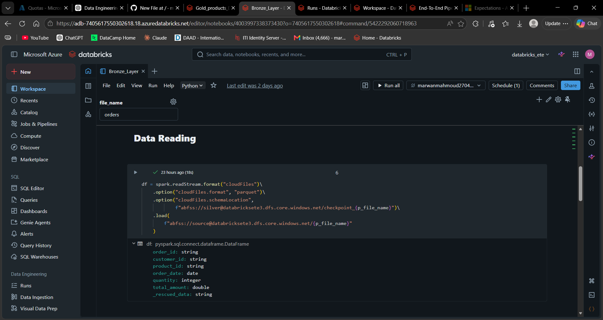
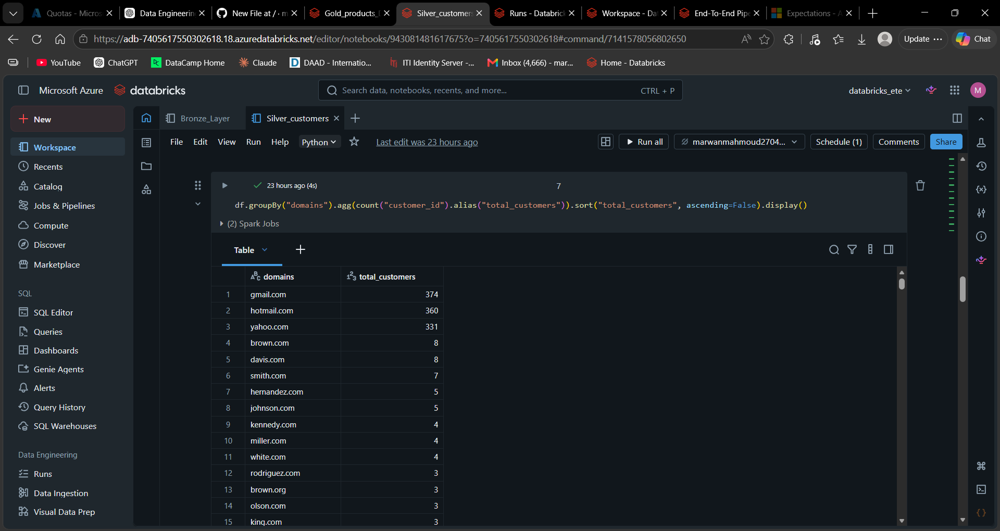
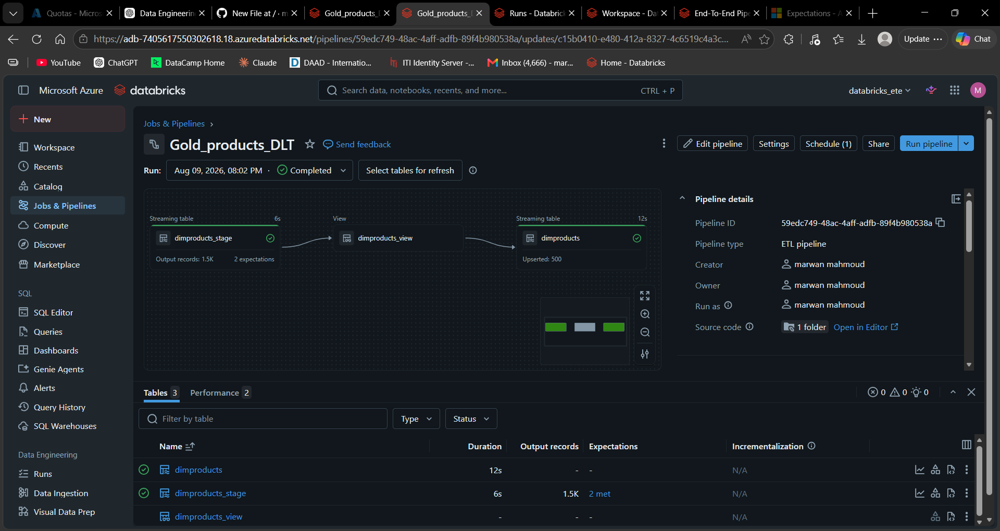
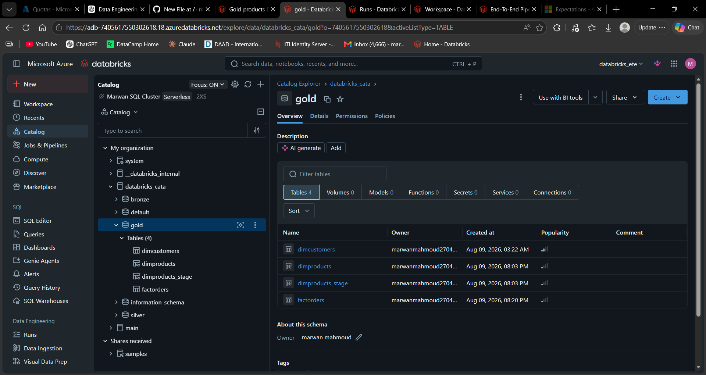

# Azure Databricks End-to-End Data Engineering Project

An end-to-end Data Engineering project built using **Azure Databricks, PySpark, Delta Lake, Azure Data Lake Storage Gen2, Auto Loader, and Lakeflow Declarative Pipelines**.

The project implements a complete **Medallion Architecture (Bronze → Silver → Gold)** and transforms raw source data into analytics-ready dimensional models.

---

## 🏗️ Project Architecture

```text
Raw Data
   │
   ▼
Azure Data Lake Storage Gen2
   │
   ▼
┌─────────────────────────┐
│      Bronze Layer       │
│     Azure Auto Loader   │
│       Delta Lake        │
└────────────┬────────────┘
             │
             ▼
┌─────────────────────────┐
│      Silver Layer       │
│ Cleaning & Transforming │
│        PySpark          │
│       Delta Lake        │
└────────────┬────────────┘
             │
             ▼
┌─────────────────────────┐
│       Gold Layer        │
│   Dimensional Modeling  │
│      SCD Type 2         │
│      Fact Orders        │
└────────────┬────────────┘
             │
             ▼
     Analytics-Ready Data
```

## 🔄 End-to-End Data Journey

The diagram below illustrates how data flows through the complete pipeline — from raw source data and incremental ingestion to transformation, data quality, dimensional modeling, and analytics-ready datasets.




### 🔄 Pipeline Orchestration

The complete Databricks workflow orchestrates the Bronze, Silver, and Gold layers with task dependencies.


---

## 📌 Project Overview

This project demonstrates the implementation of a production-style data engineering pipeline in Azure Databricks.

The pipeline:

- Ingests raw data incrementally from Azure Data Lake Storage.
- Uses **Databricks Auto Loader** for scalable ingestion.
- Stores data using **Delta Lake**.
- Applies data cleaning and transformations using **PySpark**.
- Organizes data using the **Medallion Architecture**.
- Implements **data quality expectations**.
- Builds dimensional tables using **Slowly Changing Dimension Type 2 (SCD Type 2)**.
- Creates a **Fact Orders** table for analytical workloads.
- Uses **Lakeflow Declarative Pipelines** for managed data transformations.
- Orchestrates the complete workflow using **Databricks Jobs / Workflows**.

---

## 🥉 Bronze Layer

The Bronze layer is responsible for ingesting raw data from the source into the Lakehouse.

### Key Features

- Incremental ingestion using **Databricks Auto Loader**
- Schema inference and evolution
- Raw data preservation
- Delta Lake storage
- Parameterized ingestion logic

The Bronze layer acts as the raw landing zone before any major transformations are applied.
### ⚡ Incremental Ingestion with Auto Loader

The Bronze layer uses Databricks Auto Loader with Structured Streaming to incrementally ingest raw data from Azure Data Lake Storage Gen2 while automatically inferring and tracking the schema.



---

## 🥈 Silver Layer

The Silver layer transforms Bronze data into clean and structured datasets.

The project contains Silver transformations for:

- Orders
- Customers
- Products
- Regions

### Transformations include

- Data cleaning
- Data type conversions
- Column transformations
- Duplicate handling
- Null handling
- Data standardization
- Business-rule application

PySpark DataFrames are used to perform the transformation logic.

### 🧹 Data Cleaning & Transformation

The Silver layer transforms the raw Bronze data into cleaned and enriched datasets using PySpark. It applies data quality checks, standardization, derived columns, and business transformation logic to prepare the data for analytics.



---

## 🥇 Gold Layer

The Gold layer provides analytics-ready datasets using dimensional modeling.

The main Gold tables are:

```text
DimCustomers
DimProducts
FactOrders
```

The Gold layer is designed using a **Star Schema**.

### 🥇 Lakeflow Declarative Pipeline

The Gold layer uses a Lakeflow Declarative Pipeline to build and maintain the product dimension incrementally.

The pipeline applies data quality expectations and processes product data through staging and transformation steps before loading the final `dimproducts` table.



---

## ⭐ Star Schema

```text
                 ┌─────────────────┐
                 │  DimCustomers   │
                 │-----------------│
                 │ DimCustomerKey  │
                 │ customer_id     │
                 │ customer data   │
                 └────────┬────────┘
                          │
                          │
                          ▼
                 ┌─────────────────┐
                 │   FactOrders    │
                 │-----------------│
                 │ order_id        │
                 │ DimCustomerKey  │
                 │ DimProductKey   │
                 │ order measures  │
                 └────────┬────────┘
                          │
                          │
                          ▼
                 ┌─────────────────┐
                 │   DimProducts   │
                 │-----------------│
                 │ DimProductKey   │
                 │ product_id      │
                 │ product data    │
                 └─────────────────┘
```

This model enables efficient analytical queries by connecting the central Fact Orders table with customer and product dimensions.

---

## 🔄 Slowly Changing Dimension — Type 2

The Gold layer uses **SCD Type 2** to maintain historical changes in dimensional data.

Instead of overwriting existing dimension records, a new version can be created when tracked attributes change.

This allows the warehouse to preserve historical states of dimensional entities and enables historical analysis.

The implementation uses **Lakeflow Declarative Pipelines** and change-data processing capabilities.

---

## ✅ Data Quality Expectations

Data quality rules are applied during Gold-layer processing.

Example expectations include validating critical fields such as:

```python
my_rules = {
    "rule1": "product_id IS NOT NULL",
    "rule2": "product_name IS NOT NULL"
}
```

Invalid records can be identified or dropped depending on the configured expectation behavior.

This helps prevent low-quality data from propagating into analytics-ready tables.

---

## 🔁 Fact Table Incremental Processing

The `FactOrders` table uses Delta Lake processing to handle incoming records.

The pipeline performs matching based on business and dimensional keys and supports:

- Updating existing records
- Inserting new records
- Incremental processing

This prevents the entire Fact table from having to be rebuilt for every pipeline execution.

---

## ⚙️ Pipeline Orchestration

The complete solution is orchestrated using **Databricks Workflows**.

The workflow coordinates the dependencies between different layers.

```text
Parameters
    │
    ▼
Bronze Ingestion
    │
    ├───────────────┐
    ▼               ▼
Silver Orders    Silver Products
    │               │
    ├───────────────┤
    ▼               ▼
Silver Customers / Regions
    │
    ▼
Gold Dimensions
    │
    ├───────────────┐
    ▼               ▼
DimCustomers     DimProducts
    │               │
    └───────┬───────┘
            ▼
        FactOrders
```

### ⭐ Analytics-Ready Star Schema

The Gold layer organizes the transformed data into an analytics-ready dimensional model, separating business entities into dimension tables and transactional data into the fact table.

The final model includes customer and product dimensions alongside the orders fact table, providing a structured foundation for BI reporting and analytical workloads.



Task dependencies ensure that downstream transformations execute only after the required upstream datasets have been successfully processed.

---

## 🛠️ Technologies Used

| Technology | Purpose |
|---|---|
| Azure Databricks | Data engineering & orchestration platform |
| Apache Spark | Distributed data processing |
| PySpark | Data transformation |
| Delta Lake | Reliable Lakehouse storage |
| Azure Data Lake Storage Gen2 | Cloud data storage |
| Databricks Auto Loader | Incremental file ingestion |
| Lakeflow Declarative Pipelines | Managed data pipelines |
| SCD Type 2 | Historical dimension tracking |
| Databricks Workflows | Pipeline orchestration |
| Python | Pipeline development |
| GitHub | Version control & project documentation |

---

## 📂 Repository Structure

```text
azure-databricks-end-to-end-data-engineering/
│
├── Parameters.py
├── Bronze_Layer.py
│
├── Silver_customers.py
├── Silver_Orders.py
├── Silver_products.py
├── Silver_Regions.py
│
├── Gold_customers.py
├── Gold_products.py
├── Gold_orders.py
│
└── README.md
```

### File Responsibilities

**`Parameters.py`**  
Defines reusable parameters and configuration values used by the pipeline.

**`Bronze_Layer.py`**  
Handles raw data ingestion into the Bronze layer.

**`Silver_*.py`**  
Cleans, transforms, and standardizes the individual business datasets.

**`Gold_customers.py`**  
Builds the Customer dimension.

**`Gold_products.py`**  
Builds the Product dimension and applies data quality rules and dimensional processing.

**`Gold_orders.py`**  
Builds the central Fact Orders table and connects orders with the corresponding dimensions.

---

## 🚀 Data Flow

The complete data lifecycle can be summarized as:

```text
Source Files
     ↓
Azure Data Lake Storage Gen2
     ↓
Databricks Auto Loader
     ↓
Bronze Delta Tables
     ↓
PySpark Transformations
     ↓
Silver Delta Tables
     ↓
Data Quality + Dimensional Modeling
     ↓
Gold Dimensions
     ↓
FactOrders
     ↓
Analytics-Ready Star Schema
```

---

## 🎯 Key Data Engineering Concepts Demonstrated

This project demonstrates practical implementation of:

- End-to-End ETL/Data Engineering Pipelines
- Azure Lakehouse Architecture
- Medallion Architecture
- Incremental Data Ingestion
- Databricks Auto Loader
- Apache Spark / PySpark
- Delta Lake
- Data Cleaning & Transformation
- Data Quality Validation
- Slowly Changing Dimensions
- SCD Type 2
- Dimensional Modeling
- Star Schema
- Fact & Dimension Tables
- Incremental Fact Loading
- Pipeline Dependency Management
- Workflow Orchestration

---

## 📈 Future Improvements

Potential improvements include:

- Adding automated unit and integration tests
- Implementing CI/CD for Databricks deployments
- Adding pipeline monitoring and alerting
- Implementing additional data quality checks
- Adding BI dashboards on top of the Gold layer
- Adding Infrastructure as Code for Azure resources
- Improving configuration and secret management

---

## 👤 Author

**Marwan Mahmoud**

Data Engineering | Azure Databricks | PySpark | Delta Lake

---

⭐ If you found this project useful, feel free to star the repository.
